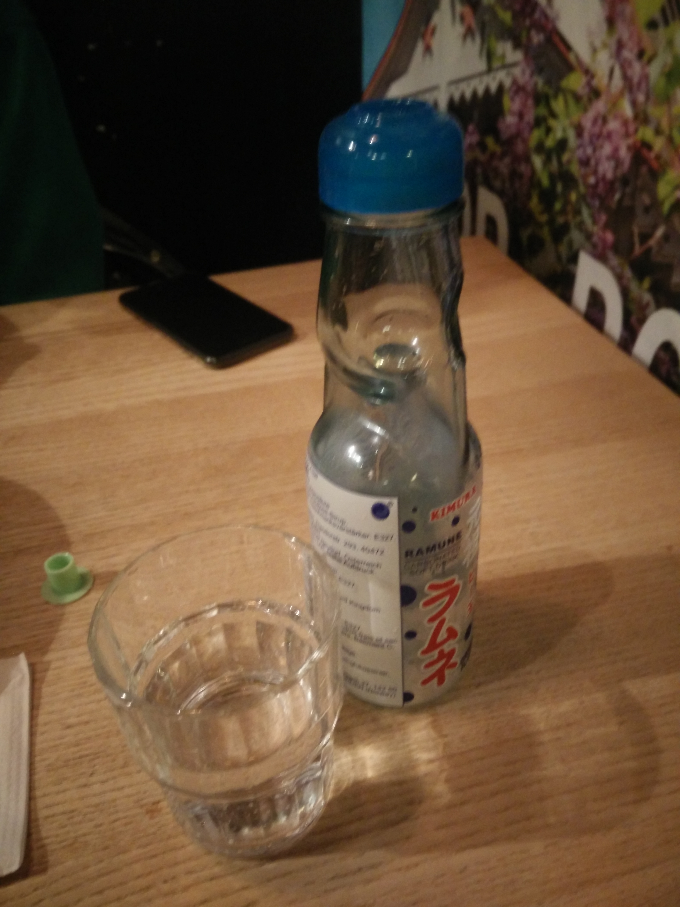

I had the pleasure to drink this beauty at the beautiful Ramen Place [Takumi Nine Sapporro](http://takumi-nine-sapporo.business.site/) in Chausseestraße. This was actually the second time I drank **Ramune** here, it was a lucky coincidence I returned to this place.

The Ramen here is delicious and the staff is friendly. The place is typically quite crowdy and we were lucky to grab a seat this night. Overall a great experience, but not as cheap as other food.

The bottle has a special opening device - seen in green on the picture below - to push down the glass ball that keeps the bottle closed. Afterwards, the ball is kept in place by two small bumps inside.

Ramune has a distinct taste, but it's fairly similar to literal lemonade. I would describe it as a mix between Sprite and Uludag.  But with Ramune, the drinking experience is not only about taste, and that's amazing!

