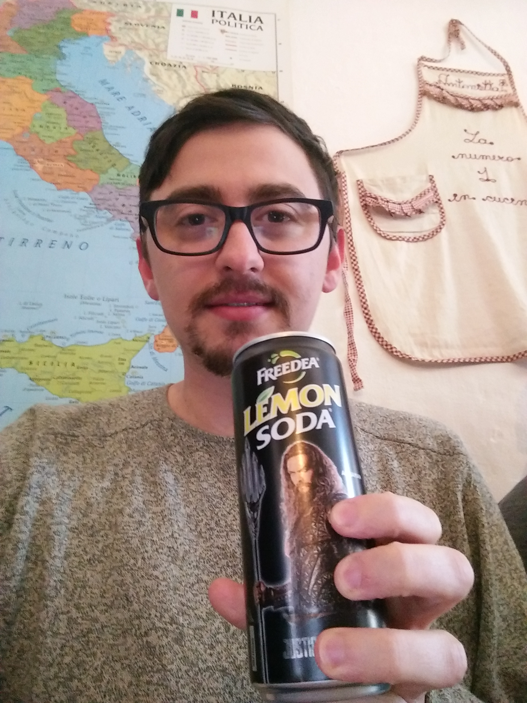

This one is funny - **Lemon Soda** is not only a great drink, but the can I got from [Alimentari](https://sattundfroh.de/alimentari/) in Fehrbellinerstraße came with special advertisement as well: The majestic Aqua Man from Justice League is proudly posing with his trident. All cans that day had the same branding, which made for a good laugh.

Alimentari is a mix between restaurant and delicatessen. You can choose between several daily dishes for 6€ and the complimentary warm bread with olive oil is a real delight. Combine that with super friendly staff, and you know it's a good choice to come here for lunch! Unfortunately I don't speak Italian, so I'm surely losing out a bit on the experience.

The drink itself is great - one of my favorites. It has a sour component and is fizzing in your mouth quite intensively, leaving a particular sensation on your tongue. You can typically find this drink in Italian restaurants and snack bars. Rewe has actually added a very similar drink to their sortiment recently.
