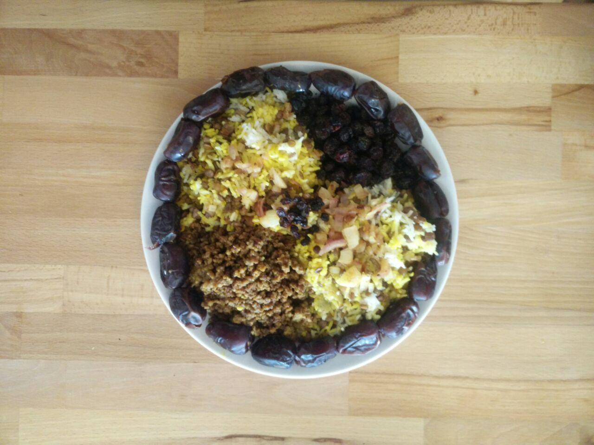
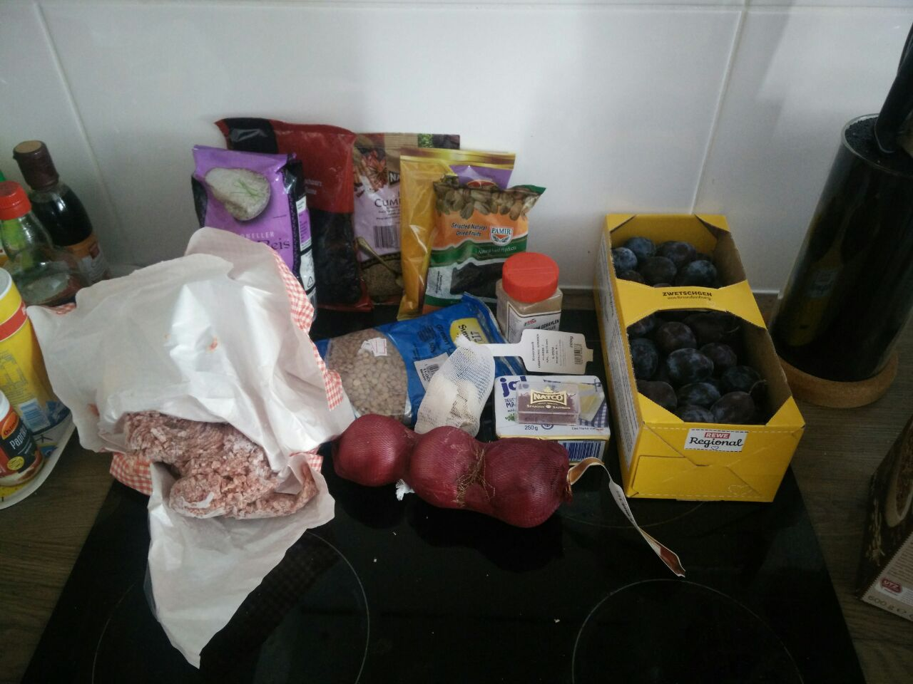
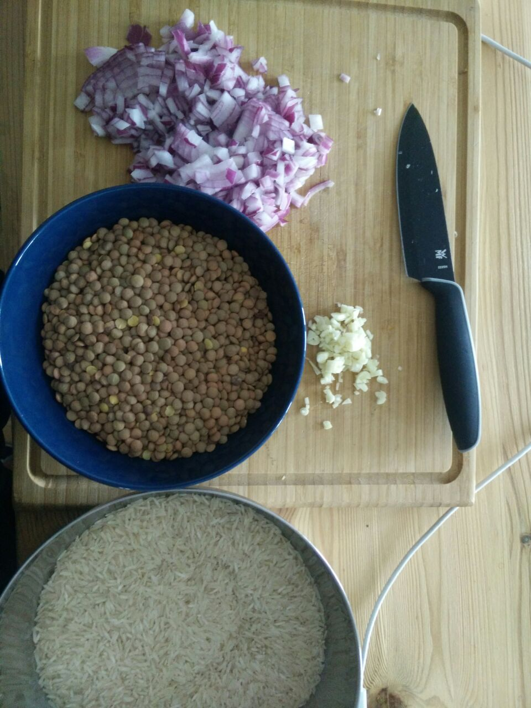
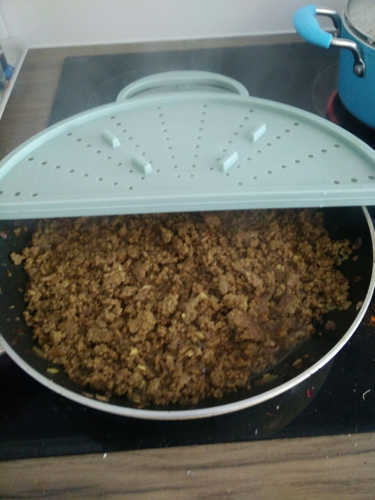
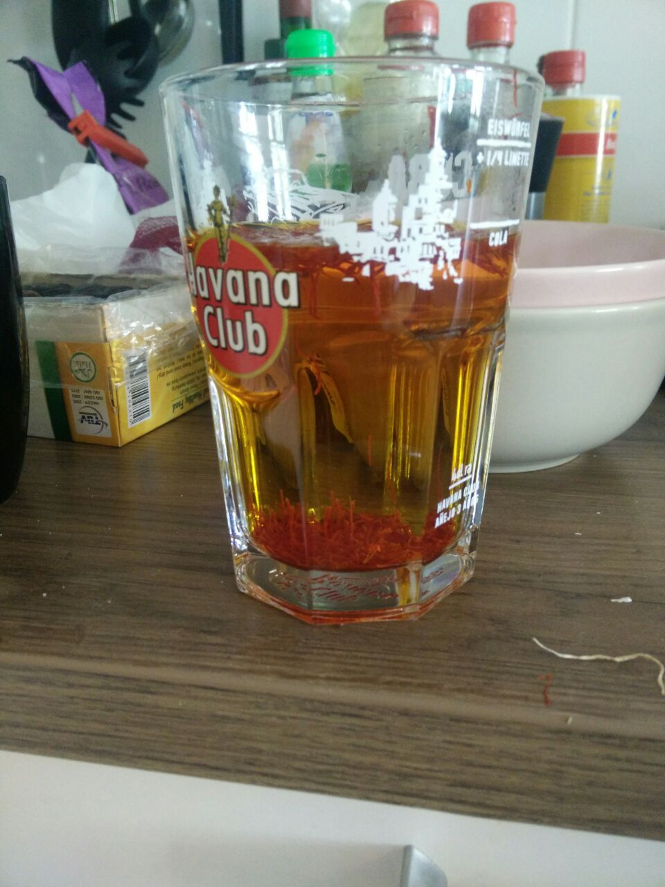
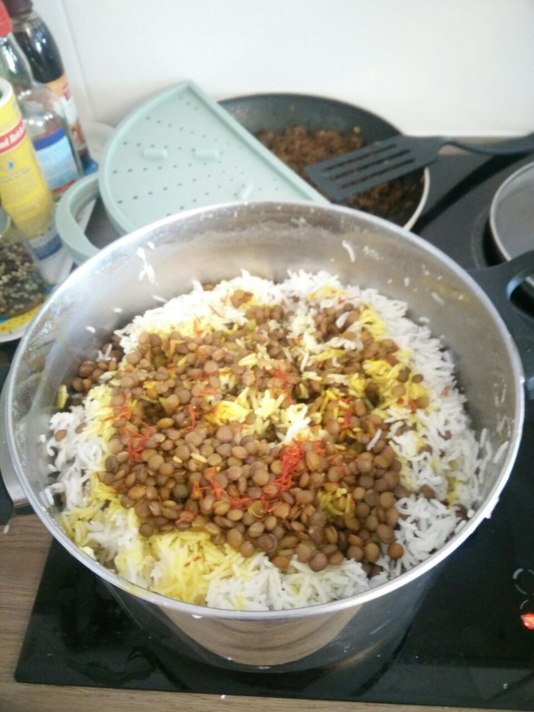

> The final dish. I love how the yellow/gold from the saffron comes out in the rice, and the raisins, minced meat and dates make a dark contrast to the bright rice. On top, I put fried onions and barberries, which is a delicious combination. It took me my entire birthday to prepare the food!

## Setting the stage

About 2 weeks ago, it was my birthday, and I decided to cook! Now I'm 27 years old, and happy about this! 😊

Just before my birthday I've been travelling a lot and many things happened in my life! So I wanted to take it slowly and relax as a change; I did not have any particular plans, and did not invite anyone over.

> Rice, lentils, onions, garlic, minced meat (mix of beef and lamb), butter, raisins, dates and butter. For spices, I got cumin seeds, turmeric powder, paprika powder, cardamom powder and real saffron! I added barberries to the recipe myself, and that worked out great. The plums are not for Adas Polo, but for Lavashak Aloo (لواشک آلو) (see [this recipe](https://www.aashpazi.com/lavashak-aloo)).

I somehow ended up finding [this recipe](https://www.youtube.com/watch?v=kwItQt9Hs90) for Adas Polo (عدس پلو). It is a Persian dish with rice, lentils, minced meat, and sweet fruits like raisins and dates. So I got the ingredients a few days before my birthday, and decided to cook it spontaneously on my birthday!

## The plot thickens

> Starting with cooking the rice and the lentils, as well as preparing the onions and garlic to be mixed with the minced meat in the pan.

For this recipe, there were so many spices and cooking methods that were new to me, and I was really afraid of trying it out! But I could muster up enough courage to just try my best and prepare the food the way I would!

> The minced meat was really delicious! You can even make out the garlic pieces on the picture 😍 Next time, I would take 1.5 times the amount of the meat, as I had way too much rice and lentils compared to the meat!

Preparing the saffron meant some especially interesting experiences to me. I had never bought saffron before, and in the supermarket where I got it I couldn't find it for 10 minutes. So I asked the clerk and he went to a cabinet kind of thing and got it out. It came in a little casket and was 4€ per gram - I felt like in an agent thriller movie! 😄

> I have no porcelain mortar to grind the saffron, so I put it into warm water which soaked up the taste and color quite well! I then also put the saffron into the pot, which helped to add more color and taste to the rice directly, but the saffron started to smell very bad! Learning: don't put saffron into the pot directly 💡

Another method I really really enjoyed was putting the already cooked rice and lentils in layers into a huge pot. It was really fun to do so, and afterwards I put the saffron and butter on top, and covered the lid in a towel to let it "smoke out".

> The rice and lentils is arranged in layers, then you poke holes into it with a wooden spatula, to let the saffron soak through the entire rice. You can also see the saffron threads that I added.

After the minced meat and rice/lentil mix was prepared, I quickly heated raisins and removed the kernels from the dates. The raisins started to slightly burn, but I managed to save them. This was another learning for me, I should have cooked them on a lower heat for a shorter duration.

Finally, I arranged the food in a beautiful setup and started to eat!

## Critical review

Overall, I am super happy that I managed to cook on my birthday. I was able to learn a lot from this experience. I was scared of making so many mistakes, but I could overcome them. In the end, the food was a very delicious, unique and new creation of mine and it nurtured me and several friends every day for more than a week.

This has helped me to see that I can create great things and that making mistakes is part of the learning process; some things I think of 'mistakes' are even beautiful creations and expressions of myself. I've become less afraid of making mistakes, and I am more comfortable in allowing them to happen!

Now I am looking for more ideas and recipes out there, and I will continue to cook whenever I feel like it. 😊