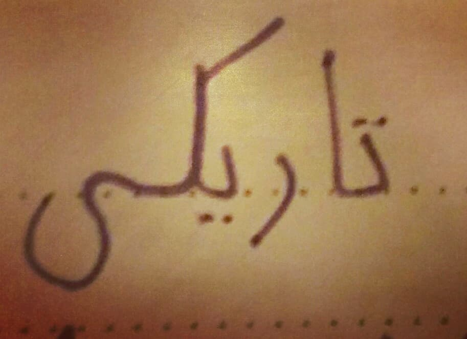

> Originally published on [Instagram](https://www.instagram.com/p/BouRdZegZEU/)

A voice in the darkness

There is a melody in me  
a shining light.

Feel its warmth  
listen to its sound  
through the thick veil  
of darkness which surrounds  
me.

Do you hear the notes?  
Do you feel the rays?  

It seems hopeless.

But sometimes  
sometimes  
a voice sounds  
so gentle and yet so unmistakable  
full of joy and harmony.  

It will guide you  
lead your way.

Listen  
listen to the voice  
and overcome  
the darkness.