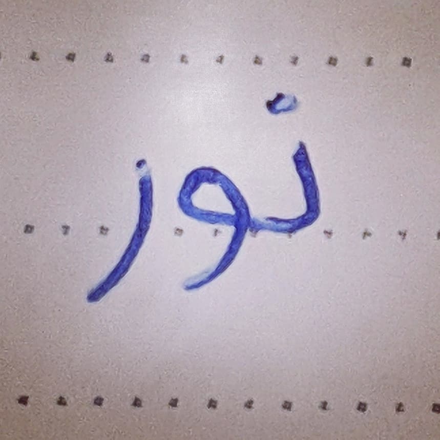

> Also published on [Instagram](https://www.instagram.com/p/BsT2lBYBHe6/)

There is  
a certain beauty about it.

When it builds up over time  
it grows and flourishes.  
Words are said.  
Feelings are exchanged.  
Hearts connect.  

But over time  
words get louder.  
Feelings hidden.  
Hearts get hurt.

And beneath a layer  
of happiness and joy  
a looming darkness is  
growing.  
Every time we break  
light shines into it.

And when we care  
for ourselves  
and heal us  
we grow stronger  
and brighter.  
Words are warm.  
Feelings genuine.  
Hearts get closer.

But if the outer shell  
prevails  
the darkness will come  
and it will reign  
and it will reign  
over your heart  
with demonic might  
and it will crush you  
and it will crush you  
ruthlessly.

And when you break  
take that light  
and keep it  
in your heart.  
And it will stay  
and it will shine  
and it will guard.

Even  
the mightiest night  
the darkest darkness  
will be overcome  
by the soothing  
light  
of love  
and joy  
and wisdom  
from your heart.