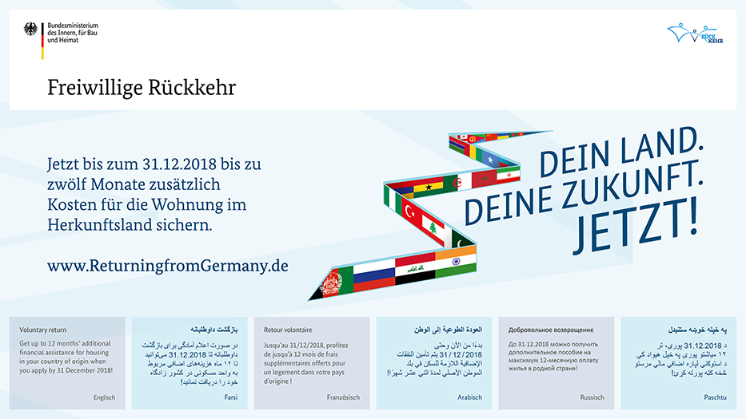

> To succeed, our policies have to come from the heart.

This is a quote by the German minister of internal affairs, Horst Seehofer, which you can find on [the homepage of the "Bundesministerium des Innern, für Bau und Heimat"](https://www.bmi.bund.de/EN/home/home_node.html) (BMI; roughly 'Federal minstry of the interior, building and home').

## Return policies that can't originate from the heart

The BMI lists "Return policies" as one of the ["top topics" on their homepage](https://www.bmi.bund.de/SharedDocs/topthemen/DE/topthema-freiwillige-rueckkehr/topthema-freiwillige-rueckkehr.html). The title "Freiwillig zurück ins Heimatland gehen" translates to "Going back to your home country voluntarily".

The following banner "Freiwillige Rückkehr" (voluntary return) has been put up 2400 times in 80 cities in Germany. The banner raises awareness for the campaign "Dein Land. Deine Zukunft. Jetzt.", which has a budget of 500.000€. The campaign's goal is to raise awareness of persons obliged to leave Germany (Ausreisepflichtige) about the option of voluntarily returning to the home country. You can read this and more [in the campaign's FAQ](https://www.bmi.bund.de/SharedDocs/faqs/DE/themen/migration/dein-land-deine-zukunft/dein-land-deine-zukunft.html).

> Quelle: BMI

## My thoughts about the campaign

My first reaction when I saw this banner myself at the U-Bahn station Alexanderplatz in Berlin (frequented by [250.000 travellers a day](https://www.centralberlin.de/blog/alexanderplatz-a-few-things-you-probably-didnt-know/)) was disbelief and laughter. I could not believe what I saw, and it looked so ridiculous!

But after a few minutes of realizing what I had read, disbelief turned into disgust, and laughter turned into frowning.

Imagine - imagine, you're coming to a foreign country. Maybe you moved there to study. Or you're starting your career there. Or, you know, you're one of the [over one million refugees](https://www.dw.com/en/refugee-numbers-in-germany-dropped-dramatically-in-2017/a-42162223) that came to Germany in the last 3 years. Or one of the [over 19 million humans in Germany with a migration background ](https://www.bpb.de/wissen/NY3SWU,0,0,Bev%F6lkerung_mit_Migrationshintergrund_I.html) - meaning either you or one of your ancestors migrated to Germany.

In any case, you or your ancestors are/have been starting a new life in Germany. Life is tough enough already, but in a foreign coutnry you might face additional challenges - culture clashes, learning German, facing racism... .

And on top of that, you're suddenly confronted with an official banner by the Minstry of interior affairs, that basically tells you to please take some money and fuck off to where you came from. This campaign is everything but coming from the heart.

It reminds me of a joke from school. Basically when someone would ask a question to the effect of "Would you pay a million euro to get me released from a kidnapping?", you would answer "No, I would pay them two million euro to keep you!". If you're willing to pay money to send someone away, this means they are really, _really_ not welcome here.

I regard this campaign as deeply damaging, and ill-advised, if not outright wicked - you can never tell if there might be a good intention hidden under the nonsense somewhere.

## Other reactions to the campaign

Others have reacted to the campaign as well, here are some impressions:

* https://www.youtube.com/watch?v=QNdfwQ3vlkA - Jan Böhmermann, German comedian, about the campaign. He describes it as "9 squaremeter of mediocrely designed misanthropy".
* https://www.instagram.com/p/BqfnpGLh3di - this shows how people have vilified some of the banners. Obviously, they are not happy about the campaign.
* https://twitter.com/ph_kraemer/status/1067065870189510658 - this person asked the BMI who's the campaign's audience, and why there is a lot of German translation on the banners. Even the languages are translated to German, what for? Might this campaign be targeted towards Germans and not, as the campaign's FAQ (but NOT the banners themselves) indicates, those who are obliged to leave the country (Ausreisepflichtige)?!
* https://twitter.com/herrfranken/status/1067044003584061440 - another thread on Twitter. Scroll down to see a funny parody of the banner, basically telling immoral politicians to retire for 5000€.

## What do YOU think?

What do you think about this campaign? Are you ok with Germany treating humans like this?

I've been talking to friends and people in my network, and there are others who are not okay with this. We are getting together to stand up against the campaign. If you're interested to join us, let me know.

If you have any comments, thoughts, ideas, please feel free reach out! You can find me via email, Twitter, Instagram, in person for a coffee, ... .
