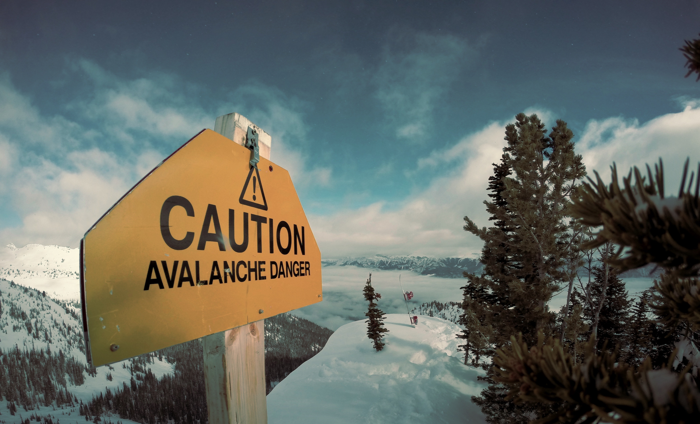

## My Year 2018 in Review

Looking back at my year 2018 and by extension the last two to three years feels incredible to me, as my life circumstances have changed quite drastically during this time period.

I am still processing the decisions, coincidences and strokes of fate that have led me here. And so I am using the time now, ["between the years"](https://twitter.com/jenshealthde/status/1076771214897659904), to reflect on myself and my life.

> I imagine change works similar to how an avalanche might come about. First, a harmless gust that sets a few snow flakes into motion, which activates a snowball effect that eventually grows into a phenomenon with tremendous power.

> [Photo](https://unsplash.com/photos/Cd2QnIKU6dk) by Nicolas Cool on Unsplash

I'm an extremely curious person and have regained my natural curiosity last year, which has been a strong driver in my journey. To me, it's simply fascinating that life has so many wonderful and mysterious _things_ to offer. I am drawn to research the reasons _behind_, the inner workings of something.

Curiosity is closely related to [truth](https://www.instagram.com/p/Bq5kxxghQMl/), as there is a truth behind everything. And truth in itself is a powerful concept. Every being has the power to influence truth. And every being is influenced by the truths that surround it. 

**I'm sharing a collection of the topics and life areas that I explored in the past year, making big leaps forward in my journey of being _my_ true self.**

## Personal Development

In the last year, I have grown tremendously as a person. I've discovered many topics and techniques that serve my **personal development**. I am amazed how much potential to grow I am now using that I haven't before.

I used to fall back to "auto pilot" in life, get comfortable and fall into a routine. But since I made it a habit to actively structure my life and continuously work on myself, I don't want to go back.

There is so much joy to find, so many mysteries to unravel, and I probably won't find them on my couch watching Netflix - even though I also enjoy doing that!

---

Shortly after my father passed away 2 years ago, I found myself at a very low point of my life. And I had just moved to Berlin, where I felt alone and weak in this city that looked so unwelcoming and huge at that time.

This is when I started to see [Jazmin](https://www.unfetteredliving.com/) for coaching sessions about once a week.

With Jazmin, I can discuss anything, whether it is talking through a recent incident at work, understanding the role I played in my family, or developing a better understanding of my strengths and weaknesses.

This commitment to work on myself on a continuous basis has turned out to be extremely helpful and rewarding.

---

Generally, I have found [Notion](https://www.notion.so/) to be a great tool for personal development. I use it for a variety of tasks, bringing a lot of structure and record-keeping into the process. For example, I try to keep a monthly syllabus (inspired by [Sid's article on personal growth](https://us15.campaign-archive.com/?u=0a756fc34189f5309c4080829&id=97cb88fca5)), where I roughly plan out the things I want to do in a given month.

There are many more experiences and experiments I did last year in the realm of personal development. I might share a dedicated blog post on this in the future. Take this list as an invitation to try out something new.

### Slow and Steady

One key insight I had last year is that improving takes **patience** and **persistence**.

Even though the sessions with Jazmin were incredibly helpful, I often had the feeling of _not progressing_. It took me about one and a half years of continuous meetings to reach a few key "breakthroughs" in my development. Looking back, every single session had played a part in making these developments a reality.

This showed me that I am really bad at acknowledging small steps in my progress. Today, I try to be confident in my decisions - as long as I am going in the right direction, the speed is secondary. Sometimes I'm slow, and sometimes I'm fast. And even going in the "wrong" direction is not too bad, as you can learn a lot from bad experiences as well.

I have come to really appreciate this compounding effect when it comes to personal development. I see this dynamic in other areas of life as well, and started to call it the **slow and steady** approach.

**It's better to walk many small steps in the right direction, rather than seeking for the one big step to solve it all!**

### Constellations

I participated in several [Constellations](http://uchangeug.com/workshops-e.html) in Hamburg, organized by [Nicole](http://uchangeug.com/about.html) who I truly admire. I really enjoy participating in constellations because you can always learn something about yourself here - no matter if your topic is being looked at or if you're a representative, or even a spectator.

These sessions are also a safe space for me to meet new people and develop my social skills. And I really like getting to know people on a deep level, as it furthers my empathy and understanding of humans as a whole.

Nicole also organizes so called Intensive Days, which is a three-day process where you can learn more about your core beliefs, using written reflection. In 2018, I participated in two Intensive Days workshops, having gained a lot of new perspectives on myself in the process.

For 2019, I am looking forward to more workshops like this. Eventually, I might even start becoming a coach as well.

### Meditation

I started to **meditate** again, using the app [Headspace](https://www.headspace.com/). For now, I try to meditate at least twice a week but I am not always getting there. I learned about concepts such as _mindfulness_, _noting_ and _visualization_ and can't wait to learn more.

I noticed that without meditating, my mind starts to get really cluttered with noise from all the screen time and things I consume. After a meditation on the other hand, I feel very refreshed and energized.

Meditating in the morning helps me to ease into the day, generally resulting into a more relaxed experience, while meditating in the evening helps me to fall asleep. Sometimes, I feel that I reach a state of pure being for a split second during a meditation. Then, I feel light, happy and calm. For 2019, I hope to translate this state into daily life as well.

### Journalling and Retrospectives

I tried daily **journalling** in the style of _The Five Minute Journal_ - I would answer a set of pre-determined questions every morning and evening. After doing this consistently for about two months, the daily practice became a grind rather than thoughtful reflection. So I decided to switch to a more ad-hoc style of taking notes whenever I feel like it, rather than a rigid daily task.

I have gotten into the habit of writing into a physical notebook, which has become very important to me. Usually, I don't go anywhere without my notebook, always ready to scribble down my thoughts or to take a quick note. I love to sit in a café, doing nothing but sipping a coffee, observing my surroundings, and writing down whatever comes up.

In contrast to the effects journalling accomplishes through written reflection and affirmation, I deem **high-level retrospectives** to be much more important for me. I tried to keep a quarterly rhythm for doing them, but frankly haven't been able to keep up with this rhythm in the last year.

---

In sum, I think the biggest insight for me in the last year is that **the important part about personal development is to take responsiblity for your own growth and well-being.** The tools, processes and people you follow are secondary to your willingness and readiness to improve.

**If you haven't done a dedicated effort to learn more about yourself, look into your family situation or other topics of importance in your life, I invite you to start with it this year - there is a lot of interesting things to discover, and a lot of potential to be unlocked!**

## Reading

In 2018, **reading** has become an important part of my life again. When I was younger, I used to read dozens of books in a year, mostly fiction. At some point, this number dropped to zero.

So I'm happy to say that this year, I have read a number of very interesting books, that I can recommend to you as well.

* `Discworld`, Terry Pratchett - [To the book review for Discworld](/posts/book-review-discworld-novels/)
  
  I really really enjoy reading the Discworld novels. This book series has been my constant fallback choice for a few years now. Last year was no different, and I've read _Moving Pictures_ (finished) and _Reaper Man_ (halfway into it) as fillers between the other books I'll share below.

* `The Phoenix Project`, Gene Kim, George Spafford and Kevin Behr - [To the book review for The Phoenix Project](/posts/book-review-the-phoenix-project/)
  
  Having always been interested in the management of software teams, and taking over more responsibilities in a growing team at the time of reading, `The Phoenix Project` was a very useful and informative read. What strikes me now, looking back, is that this book is the only one in here that's related to my profession in software development: work has become less and less of a priority for me.

<!-- TODO: /posts/book-review-i-hate-you-dont-leave-me/ -->
* `I Hate You - Don't Leave Me`, Hal Straus and Jerold Jay Kreisman - [To the book review for I Hate you - Don't Leave Me (Pending)](#)

  I started to read this book in May, but I still have not finished it yet. The content is very dense (in a positive sense - the information density is high), giving insights into a mental disease that's still poorly understood, the Borderline Personality Disorder (BPD). I plan to finish this book in 2019, as I want to learn more about psychology, personal disorders and human behaviour.

* `Start with Why`, Simon Sinek - [To the book review for Start with Why (Pending)](#)

  This is a great book that argues that `HOW` and `WHAT` we are doing are secondary to `WHY` we are doing something. This book set me up on my path to formulate my own personal `WHY`, which is a top priority in 2019 for me. I can recommend it to anyone looking for inspiration for their own vision.

* `Conversations with God`, Neale Donald Walsch - [To the book review for Conversations with God](/posts/book-review-conversations-with-god)

  This book was... rich! After starting to read it for a while in August, I put it aside and only got around to finish it in early December! This is because it's very deep, and I took a lot of notes and marked lots of passages in the book.
  
  I want to re-read this book in 2019, as it contains a lot of inspiring content that triggered different thought processes in me.

* `The Kite Runner` and `A Thousand Splendid Suns`, Khaled Hosseini - [To the book review for Kite Runner and A Thousand Splendid Suns](/posts/book-review-the-kite-runner-a-thousand-splendid-suns/)

  I was reading these two books by Khaled Hosseini during my travels in India in December. They offer insights into **Afghani** culture, and I recommend to read them together. One day, I also want to travel to Afghanistan, to experience the country first hand.

  Back in Berlin, I ordered the first issue of [Afghan Punk Rock](https://afghanpunkrock.bigcartel.com/). I am looking forward to read the magazine, as it will give me further inspiration and insights into Afghanistan and its people.

I already have a long list of books that I want to read in 2019. Currently, I'm reading `Sapiens` by Yuval Noah Harari, after I got many personal recommendations for this book. I am very excited!

## Expressing Myself

2018 has been the year where I re-learned to express myself in various forms. Honestly, in spite of all my advancements in self expression, I still often struggle to express myself with authenticity and confidence. Sometimes, I block myself, in fear of rejection or out of a feeling of uncomfort.

This is definitely an area that I want to expand on in 2019, as I believe that **expressing myself is a huge part of my life's purpose**.

### Writing

For me personally, writing is one of the easiest forms of expression, and sometimes things just come flowing out of me that I put on paper.

In June, I've seen [Sailesh](https://www.instagram.com/sailesh_n/) perform at a Spoken Word event. When I approached him afterwards to tell him that I would like to write like he did but it never seemed to happen, he advised me to _just start writing_. And that's what I did!

So in August, I had a downright surge of creativity! I wrote several very personal articles and poems and published a few of them on this blog or elsewhere.

This journey was crowned at the beginning of September, where I spontaneously read a letter to my late father in front of a crowd. I had written it the day before and it was the **first time** I recited a personal piece publically!

I will never forget how nervous I was, and how much love, attention and respect the audience gave me. This showed me that **safe spaces are incredibly important** and that it's important for me to feel comfortable to be able to share my thoughts or feelings.

This whole experience was very emotional for me, and I'm incredibly thankful to everyone who inspired me on my writing journey, including Sailesh, [Candice](https://www.instagram.com/okcandice/) and [Esther](https://www.instagram.com/howtogrowaflower/).

---

Throughout November, I participated in [NaNoWriMo](https://nanowrimo.org/), the National Novel Writing Month. I managed to start a story of about 4000 words. Again, I tried the **slow and steady** approach, by writing at least a sentence a day.

This was a nice challenge and I took away a lot from it, even though I did not hit the suggested mark of 50000 words. I want to participate again next year! I noticed that it's good to have a rough idea for the most important characters in the story, maybe something like a character sheet.

---

I am very happy to have found this medium for myself, and will keep honing my poetry and writing skills.

### Raising my voice

In November, I passed by a poster about a German campaign to send refugees back to their country of origin. I wrote about this in [Policies from the heart](/posts/policies-from-the-heart/), and connected with other people that shared their ideas how to raise awareness about this and urge the ministry to shut down the campaign.

This was the **first time** I raised my voice in a political debate. I think it's important for everyone who has a voice to use it for a good purpose, and for people with similar opinions to band together. There are many marginalized people that are not yet heard as loudly as they should be in our society, and it breaks my heart. 

Therefore, I want to learn more about how to participate in the political and social discourse effectively in 2019.

### Sports & Dancing

In the last year, I learned that it's very important for me to **connect with my body**. It's my responsibility to listen to my body and care for its well-being. This includes a healthy diet, a regular sleep rhythm and a good sports routine.

---

I joined my good friend [Chau](https://twitter.com/ChauPow) for her weekly dance lessons - she introduced me to the dance style [popping](https://en.wikipedia.org/wiki/Popping)! I am still amazed by how much I still have to learn about my body. Which movements feel good, which movements am I _able_ to pull off, and how difficult it can be to go with the flow!

At a recent jam session, I even danced freestyle inside of the circle for the **first time**. This was so thrilling, and made me really happy. I love how supportive the dancing community is, it's often that you'll get some tips how to improve, or you cheer and praise each other for their nice moves and ideas.

### Hand Crafts

This year, I tried some [origami](https://www.instagram.com/p/Bq8JfGbF9er/) for the **first time** and really liked it. Doing hand crafts like origami reminds me of meditation 😊 It's very relaxing for mind and body.

I also explored other hand crafts, such as sewing up holes in my clothes or other textiles, and creating small items such as bookmarks.

In 2019, I want to learn more about all the different ideas and methods humanity has come up to create common day objects, and artistic pieces.

### Cooking

To celebrate my birthday in September, I cooked Persian food. I wrote about this experience [here](/posts/what-i-learned-from-cooking-on-my-birthday/).

Since then, I tried to cook Persian food once every week or two, which would usually be enough food to eat for the next few days. Until now, I cooked Adas Polo (see the blog post), [Fesenjoon](https://turmericsaffron.blogspot.com/2009/12/fesenjoon-pomegranate-walnut-chicken.html), [Ghormeh Sabzi](https://turmericsaffron.blogspot.com/2008/12/ghormeh-sabzi-persian-herb-stew.html), [Mirza Ghasemi](https://turmericsaffron.blogspot.com/2009/02/mirza-ghasemi-northern-irans-eggplants.html), [Estamboli Polo](https://turmericsaffron.blogspot.com/2014/08/estamboli-polow-persian-tomato-rice.html), [Ab Goosht](http://www.thepersianpot.com/recipe/abgoosht-lamb-chickpea-soup/), [Dopiazeh](https://turmericsaffron.blogspot.com/2009/10/dopiazeh.html), [Ash-e-Jo](https://turmericsaffron.blogspot.com/2017/02/ash-e-jo-barley-soup-with-spinach-and.html) and more 😍

---

There is so much to discover in cooking, and every new recipe is like a new perspective on life. I think food makes a huge part of human culture, and can serve as a medium to understand it better, similar to language.

In 2019, I want to follow lots of new recipes and keep up the cooking routine. It's so much fun and delicious!

## Developing a Vision

It was soon after my birthday that a very strange thing happened to me. I had recently been on different trips, a company retreat and an Intensive Days workshop, so I was still quite excited and disturbed from the recent experiences.

When the dust from all the recent action had settled, I was from one day to the next filled with a **deep certainty** I had felt never before.

**It was _knowing_ that quitting my job was the only right decision for me.**

After all the time, energy and attention I've put into the job for the last 2.5 years, this was a very big step. It was also tough to [say my farewell](https://www.prisma.io/forum/t/thank-you-nilan/2436/13?u=nilan) to the community I had fostered and loved for so long!

---

This decision freed up a lot of space and time for me to explore my newfound interests. But most importantly, this gave room for me to get to know myself better and start to develop my very own vision.

Even though I made a lot of progress here, I feel like my journey has just begun. I'll share the pieces that I already know - and I can't wait to develop all of this further!

Mostly, my vision revolves around **connecting with people**, which I absolutely love. It allows me to learn from their experience, listening to their stories and contribute in various ways to their journey. And together we have a good time and maybe share a drink or some food.

### Cultural Exchange

To connect with a person, understanding their culture is really helpful. This is why cultural exchange makes a central part of my vision - getting to know different cultures, bringing humans from different parts of the world together, and fostering respect and understanding for each other.

---

I have made various new experiences this year, broadening my horizon for new cultures and traditions. Here are a few:

* In May, I invited someone to Germany for the **first time** - my Indian friend [Divyendu](https://www.divyendusingh.com). I had the pleasure to show him Berlin, and learn a lot about Indian culture and life in general.

* At the end of August, I was invited to an Eritrean wedding in Berlin. It was actually the **first** wedding I ever attended, and it was really amazing. We danced, ate and sang together and it was so enriching to get in touch with Eritrean culture and people.

* At 21st of December, I attended the [Yalda Night](https://en.wikipedia.org/wiki/Yald%C4%81_Night) festivities in the Iranian House of Culture in Berlin. Together, we listened to music and poems, ate together and followed the [Fal-e Hafez](https://www.hafizonlove.com/fal.htm) tradition of reading a poem of Hafez to answer a question in life.

* In December, I attended my **first** couchsurfing event ever, in Berlin. Someone decided to invite everyone to his house for a relaxed party on the 25th of December. I met many many amazing people here and shared stories, food and music with them. I met people from Azerbaijan, South Korea, India and more.

* For the final days of December, I hosted two girls from Croatia myself. I love to share my house with friendly and open-minded people and get to know them better, cooking together, going for a walk or just having a good time at home.

---

I feel like this world can use a whole lot more of intercultural exchanges and relationships. And everyone can learn something from everyone.

By putting our heads and hearts together, we can all grow into something bigger. This notion is what I tried to convey in my second blog post this year - [Tonight](/posts/tonight/).

I hope to be able to contribute in this regard in 2019.

### Language Learning

Like food and music, language can tell a lot about a culture. And, to connect with another person, speaking the same language is very important. That's why language learning has a big focus in my life.

---

I picked up my Farsi Studies again in May - after some years of learning the language on and off - and visited different language exchange meetings in [the vast meetup scene in Berlin](https://www.meetup.com/cities/de/berlin/).

This time, I followed the **slow and steady** approach from the start. I enrolled for the second Farsi course in succession in August, as I had found a great study group with an amazing Farsi teacher, [Nasib](https://persisch-lernen-berlin.de/).

For me, this continuity was a big success, as I had started to learn Farsi twice before, but could never make it last long. Encouraged by this success and inspired by the book `Start with Why`, I reflected on [Why I am learning Farsi](https://nilan.netlify.com/posts/why-i-am-learning-farsi/) in a blog post.

---

In November, I went to [Expo Lingua](https://expolingua.com/) to explore my interest in language learning. I attended interesting talks and workshops, [wrote my name in Persian kalligraphy](https://www.instagram.com/p/BqPk_4WhdzI/) and met a lot of language learners.

At the conference, there was a booth from [AIESEC](https://www.aiesec.de/), where I signed up for a conversation with a friendly girl who showed me possible destinations for a **social internship**. I had the idea of visiting the Middle East for an internship for a few weeks in 2019.

What's more, she is doing her Arabian Studies at [FU Berlin](https://www.fu-berlin.de/), and shared her advice on another idea I recently had - to study **Iranian Studies** at FU. She was a big help with this! Let's see where both these ideas lead in 2019.

---

I am focusing on learning only Farsi for now. My goal is to be able to read and write poetry in Farsi, and to get there will take some time.

My love for poetry has become so strong this year. Have a look at [this podcast](https://www.chaiandconversation.com/podcast/rumi-rooz-o-shab-part-1) where the participants discuss an interpretation of a poem by Rumi.

Once I feel more confident with Farsi, I want to start learning another one. I am interested in Arabic, Kurdish, Turkish, Urdu, Hindi and others. I also want to connect with more language learners, to share experiences and learn together.

### Travelling

Travelling is another part of my vision, because it helps to meet new people and cultures.
Visiting a new place that is different from all what you have seen before is simply breath-taking to me.

It can be quite overwhelming and exhausting to travel at times, but it's always worth it. And you'll usually meet friendly locals or other travellers, which I think is pretty amazing.

---

In July, I travelled to Spain for a summer retreat with a group of about 10 persons. We spent two weeks in a house in a village near Santiago de Compostella, and it was truly amazing! This trip actually revived my love for travelling and language learning.

---

In September, I went to a company off-site in Croatia. That was my **first time** in Croatia, and it was beautiful! I had not expected such a mediterran flair in an Eastern European country. The landscape, food and mentality is reminiscent of Italy with a core Slavic character, which makes for a beautiful combination!

Another positive surprise to me was that German is wide-spread in Croatia, more so than English. So we could actually buy food and had interesting conversations with locals at the market in German! As a team building activity we went Kayaking, another **first timer** for me. It looks easier than it is 😅

---

After quitting my job, I wanted to use the time to travel. First, I followed the invitation to stay a weekend with my dear friend [Osama](https://twitter.com/abmorni) in Paris at the end of November, where I met his sister and many of his friends.

The dinner we shared was delicious and I took away many many inspirations from the interesting conversations and people. And, I explored Paris including one or another café 🤓

While exploring the city, and walking around mindlessly, I was also suddenly caught up right in the middle of [a clash between the police and members of the "Yellow Vest" movement](https://www.nytimes.com/2018/11/24/world/europe/france-yellow-vest-protest.html). This was scary!

---

When chatting to my Indian friend Divyendu, I spontaneously booked flights to India to travel the country. This was an amazing trip which lasted two weeks - I was roughly one week in Bangalore and Jammu each and a few days in Delhi.

In Bangalore, I mostly relaxed at home to read. I did end up going to a big tech meetup, and meeting a few people for coffee too, which was great. My friend Rushal actually shared his thoughts on our meeting [here](https://medium.com/let-me-buy-a-coffee-for-you/walk-and-talk-with-nilan-marktanner-3c396f2cee61). I saw that Rushal, like many Indians, wear rings, which has a background in astrology. I want to get a ring for myself!

In Jammu, I also attended a wedding of a highschool friend from Divyendu. That was a very special event for me. Wow, so many people and so much food! And everyone was very friendly and accomodating with me, which was extremely humbling.

My experience in India was intense. There are _a lot_ of people and a lot of impressions. Now, a month after the trip, I am still processing what I saw! And even so, I want to return to India soon, as I have not even seen a tiny bit of the country, it's huge!

---

I have no concrete travel plans for 2019 - yet. I want to take some rest in Berlin for a few months before going on another big trip. However, my travel to India showed me that you don't need a lot of planning to have a successful trip. Maybe I'll travel somewhere fun spontaneously?!

### Technology with a Social Impact

Coming from a strongly technical background, I have come to the conclusion that technology should serve people, and not the other way around. Many challenges in our society and on a bigger scale can be tackled much better with the right technology.

---

At [Revision 2018](https://revision.io/) this November, I had the pleasure to learn about effectively using **technology** to make a **social impact** in this world.

Amongst other interesting talks and discussions, I watched a presentation by Diego Agulló who spoke about ambition. After his talk, I got a copy from him of his book [Betraying Ambition](https://circadian.co/product/essay-on-ambition/), which is high on my reading list.

There was also a great panel discussion organized by the [Digital Arabia Network](https://digitalarabia.network/) on experiences, challenges and possibilities in the Arabic world.

---

For 2019, I am looking forward to sharpen my technical skills, and develop a clearer vision with a social impact. I can then use my technical abilities to realize it.

## A Look into the Future

I still can't believe how eventful 2018 has been for me.

This year, I started to explore a broad range of new interests and took a close look into many areas of my life. And there is still so much more to explore, learn and experience. I'm so happy to finally take over the responsibility for my own life and to grow my interests, knowledge and relationships and subsequently grow as a person.

---

I realized that with all the new and unusual uncertainty in my life (_without_), I am becoming certain about myself (_within_).

My focus in 2019 will be on designing a life style that allows me to continue this journey of self-discovery, to realize my vision and hopefully being able to contribute to this world with my skills, while making a living for myself.

My hope for 2019 is to find a lot of inspiration in texts, ideas and people. And, in return, to inspire a lot of people as well.

---

I am so incredibly grateful to every person I have met along the way. I am grateful to be able to experience the joy of life. I don't know what will happen next year. Looking back to a wild and crazy ride in 2018, I am thrilled for 2019.

**I know that in the past year, I started to set a few snow flakes in motion. I can't wait to see the avalanche that is yet to come.**