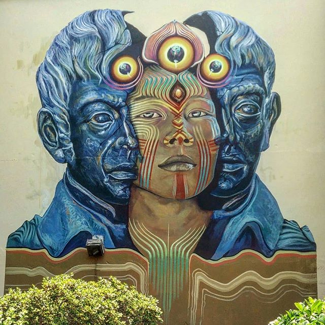
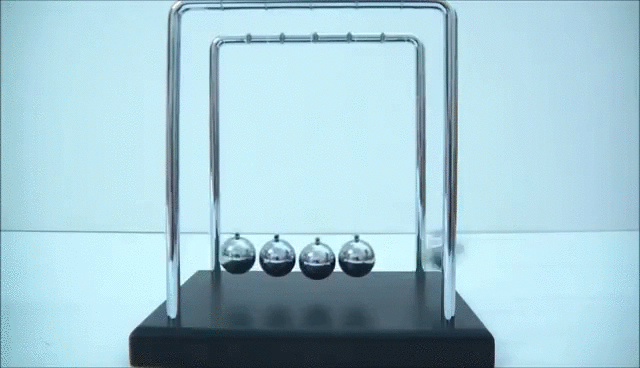

<!-- One paragraph about WHAT this article is about. Another paragraph WHY I'm writing and publishing it. -->

> Show yourself. I took this [photo](https://www.instagram.com/p/BludS0DFXYk/) in Caldas de Reyes, Spain, in Summer 2018.

---

A few particular observations have been crossing my mind frequently in the recent months:

* **You have a big impact on your reality.** 
* **Life is about taking ownership of that impact.**

For me personally, this is a big learning. I expect that fully living these learnings will have a big impact on my life.

## Why am I writing this article?

I am writing and sharing this blog post with two goals in mind:

1) **Formulating my current understanding of this observation.**  
  
  <!-- Putting vague thoughts into writing refines them and gives me better clarity, maybe helping me to reach a whole new understanding that I wouldn't have reached otherwise. It also serves as a relief for my mind, as these thoughts are somewhat "heavy". They represent my recent learnings regarding my _fundamental_ understanding of life, myself, everything. -->

2) **Encouraging the reader to take away some learnings and inspiration.**  
  <!-- If successful, this is obviously advantageous for the reader. It might even result into a more rewarding, fulfilling, happy life for them. And this also is advantageous for myself. -->

These goals also apply to many articles I previously shared, and both are advantageous for me. So, it's basically a win-win 😋

## The biggest opportunity imaginable

<!-- A few examples of simple actions. How simple it is to change reality. -->

We humans have became very used to many aspects of our abilities. So much so that we sort of have become desensitized to our true powers. At least, I have.

* Stand up right now if you're sitting or lying down. Walk a few steps into one direction, and return to where you started. **You just changed reality.**

* Greet the next person you see with the words "Hello there, what a wonderful day to meet you!". **You just changed reality.**

* Take a pen and write the phrase "This is my reality." on a piece of paper. **You just changed reality.**

These simple examples might sound silly to you. But they prove that you have literally the ability to change reality, right here and right now.

How often did you _think_ of an idea, _committed_ to it, and finally _realized_ it? Isn't that simply amazing?! **It's simple to influence reality**.

I know, simple doesn't always mean easy. But "on paper", there really only is one condition to pull it off: being alive.

> Life is the biggest opportunity imaginable. With life, an unimaginable number of realities is possible.

## A chaotic system

<!-- Postulate that reality is a chaotic system: Small actions can have a huge outcome to reality. Fortify that postulation with my own example. -->

Our real world is made up of countless variables that all together form our reality. In this reality, there are many actors who interact in various and complex ways with each other and with the world, somehow influencing these variables.

> Reality is [a chaotic system](https://en.wikipedia.org/wiki/Chaos_theory).

There's only one variable you can directly influence. Yourself. **You have an impact on your reality.** This simple observation has mind-blowing consequences.

Every decision you make, every action you take opens up a new field of possibilities. And due to [the butterfly effect](https://en.wikipedia.org/wiki/Butterfly_effect), we often cannot say what the exact impact of our actions is.

---

This year, I am going through a lot of transformation. I am figuring myself out.
What life am I envisioning? Where do I want to live, how do I want to earn money, what is my contribution to this world?

I am getting a better idea in what direction I want to grow. 
And lately, I am becoming more aware of the extent of my own impact. This sounds quite abstract, so here's a recent example.

## How I got a topic for my master thesis

At the end of last year, I came to the conclusion that I want to finish my master studies in Computer Science that I had postponed about 2.5 years earlier. Apart from one exam, that meant working on a master thesis for 6 months, as I had finished all other duties for finishing my master before.

After quitting my job, it didn't take a long while to get the **clarity** that finishing my master studies is what I want. I was also **committed** to put in the required time of 6 months. Now came the biggest hurdle, actually **realizing** this project.

I started to reach out in my personal network, browsed the websites of various Computer Science institutes of my university with the **intention** of finding a master thesis.

In December last year I spent three days in my hometown, having about 8 meetings with friends, fellow students, postgraduates and professors with the intent of finding a master thesis.

It was a stressful time, and the conversations didn't go too well. Either the potential topics weren't a good fit for me, there was currently no capacity for another master thesis at the institute, or there were other hurdles in the way.

> I almost lost hope to finish my master thesis, I had given my best and seemingly had not succeeded in finding a suitable topic.

But about two months later, I received an email from a postgraduate. She would have the capacity for another master thesis soon. Since then, I met her a few times to discuss the potential topic, I've worked through various papers she suggested.

I plan to officially register my master thesis this week, and hand it in in 6 months. Exciting times!

---

My actions didn't **have** to lead a master thesis for me. But in the end, my actions resulted in the fact that I do have a master thesis now. Had I not been clear about that, committed to it and initiated these conversations, it wouldn't have happened.

And looking back, I can break down this process into many simple actions, similar to the ones in the previous section. The "difficult" part for me was to get clear about what I want. From there, physically, nothing was difficult.

## Call to action?!

What to do with this observation? What is life and reality anyway?
Here's my general plan:

* Get more clarity about _what_ I am looking for in life
* Commit to it internally
* Realizing it externally

## Some questions

* How do your _inner actions_ affect reality?
* What do you think?  Maybe it is obvious to some. Others might disagree. I'm curious to hear your perspective if that's the case.

# NOTES

BELOW THERE ARE NOTES THAT DON'T BELONG TO THE BLOG POST YET OR ARE ALREADY COVERED

## Your agency

Moving your arm, raising your voice or writing something down as in the previous examples are very **tangible** actions with a **direct impact** to the physical reality.

What I find even more interesting are  frankly mind-blowing, when applied to more **intangible** actions.

## The essence

> Life is the essence.

## Ingredients

* Willpower/Intention
* Persistence
* Determination

https://twitter.com/matthaig1/status/1124786478347956224

## Actions speak louder than words

It feels kind of silly to write this article. I feel like trying to find words for how colors look like. I am only able to come up with clumsy descriptions for fundamental truths that I _had_ a very deep and natural understanding for ages ago.

But somewhere along the way, I lost this understanding. And with that, I lost my aliveness. Luckily, I am already far down on my path to regain my aliveness. And it wasn't perfect descriptions that got me here. It was **actions**.

The cool thing is that you cannot not act. And I've experienced first hand how your actions 

## Language

* Languages have an own concept for living beings (somehow weirdly called Animated objects): https://en.wikipedia.org/wiki/Animacy