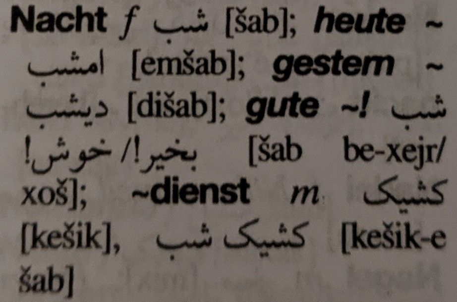
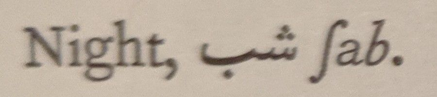
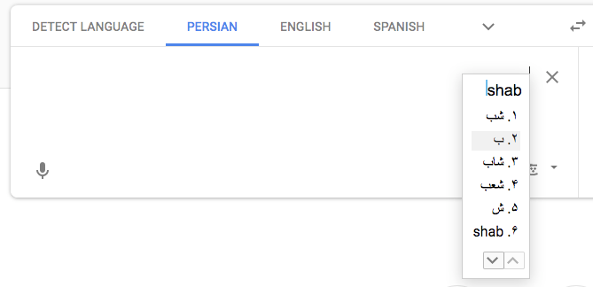
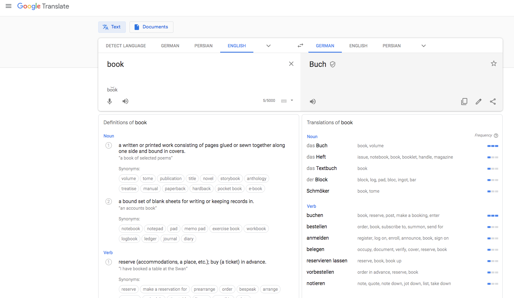
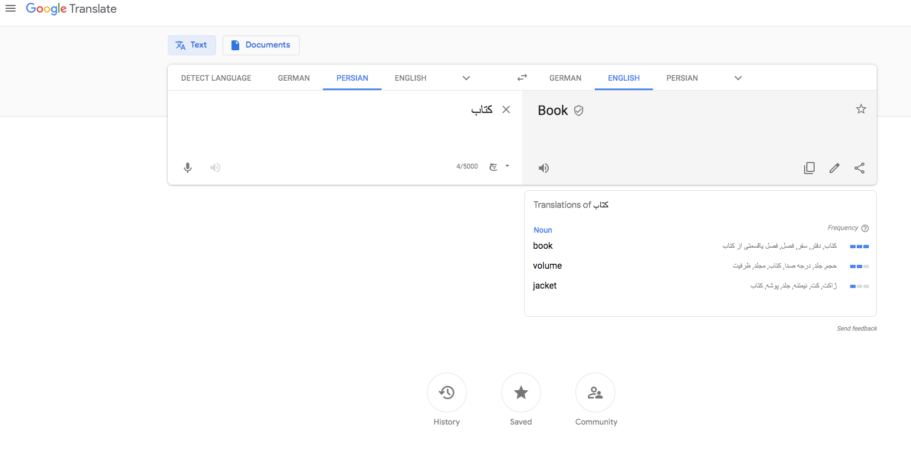
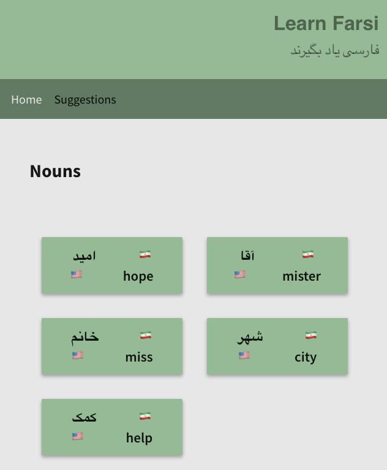
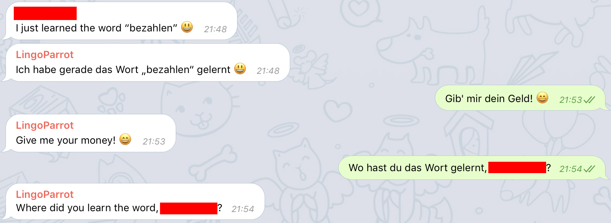

While trying to improve my language learning experience, I was looking for a **dictionary API** for translating words between different languages - much like the author of [this blog post](https://medium.com/@martin.breuss/finding-a-useful-dictionary-api-52084a01503d). I am mainly interested in translations between Farsi and English/German.

I shared in a previous blog post [why I am learning Farsi](/posts/why-i-am-learning-farsi).

This started a long research on tooling for language learning, and a reflective process about my learning experience. Here I am collecting my results and thoughts.

## Tools I use for learning Farsi

Besides paper dictionaries and Google Translate, I am using a few other tools for my Farsi studies.

[Chai and Conversation](https://www.chaiandconversation.com/) is a podcast that focuses on conversational Persian. It is the best resource I know for learning Farsi in an interactive manner, while listening to people actually speaking it. Chai and Conversation comes with many additional resources. The [poetry section](https://www.chaiandconversation.com/persian-poetry) is my favorite one, I have listened to those resources many many times already.

I couldn't find a lot of resources on Persian grammar, but there is a pretty cool series of videos on YouTube on [Persian grammar](https://www.youtube.com/watch?v=aJpQXo-hULs&list=PLBv6B6E0IuHjkXAHUwFScZ83NZ4hswXRO). I have watched a couple of videos and come back to some of them from time to time.

Ali Jahanshiri publishes many useful tools for Farsi learning on [his website](http://www.jahanshiri.ir/). Most often, I am using the verb conjugator which is super helpful for conjugating verbs or learning more about new verbs (especially the present stem [because it cannot be derived](/posts/farsi-verbs-basics) from the verb directly). I know no other resource where I can learn the present stem of a verb.

I use a few books in my Farsi studies, like [The Rubaiyat of Omar Khayyam for Students of Persian Literature](https://www.amazon.com/Rubaiyat-Khayyam-Students-Persian-Literature/dp/1588140830). It is a collection of poems from Omar Khayyam's famous Rubaiyat. Every poem is printed in three version: the original in Farsi, a transcripted version and a translated English version. Working with this book helps to learn pronunciation of Farsi words, and is a good entry into the poetic vocabulary and style of Farsi.

## On Dictionaries

Currently, I am using both traditional (paper) dictionaries as well as Google Translate for my Farsi studies.

> Both the [Langenscheidt Universal-Wörterbuch Persisch](https://isbnsearch.org/isbn/9783468182501) (first picture; printed in 2002)  and the [Student's Edition of Persian Vocabulary](https://isbnsearch.org/isbn/0521091543) (second picture; printed in 1975) provide phonetic transcription for Farsi words, like /∫ab/ or /šab/ for night.

In my experience, most paper dictionaries offer the **phonetic transcription** for Farsi words. I like to work with analog books, also when reading. Touching the pages, guiding my finger along the words, smelling the paper - that is an enjoyable experience, and I feel **more connected** to the words printed on paper than such I see on my screen.

Manually navigating the pages of to find the right starting letter helps me to become more familiar with the Persian alphabet, and I might just come across an interesting word that I can pick up "on the way" to my destination (the word I want to translate right now).

---

On the other hand, it still takes me much longer to look up a Farsi word than looking up an English or German word, as I'm not that familiar yet with the Farsi alphabet.

Looking up a Farsi word online is equally fast as looking up a German or English word, especially when using Google Translate's nifty input feature - you can type the word in its approximate English transliteration using English letters, and Google Translate offers the best matching Farsi equivalents.

> Google Translate offers a nice input for searching Farsi words. You can basically enter the 

For western languages like English, Spanish, French, German etc., Google Translate offers advanced features such as 

* **audio playback**
* **phonetic transcription**
* **voice input**
* **definitions**
* **examples**
* **synonyms**

> Google Translate offers more features for western languages than fit on my screen.

To this day, I have not found a good digital resource that offers reliable phonetic transcriptions for Farsi. For Farsi, Google Translate offers not much beyond the basic translation feature.

> Google Translate for Farsi mostly offers the basic feature of translation.

And languages change, like, a lot. That means that a dictionary is most likely already _outdated_ once printed.
Printed dictionaries also miss out on crowdsourcing: digital dictionaries can be made accessible such that anyone can suggest an improvement or add new content.

Both of my paper dictionaries only cover the most important words, and very often it doesn't contain the word I'm looking for right now. A digital dictionary can potentially provide the translation for any word, however exotic it might be.

Unfortunately, **the quality and reliability of Google Translate suffers** a lot compared to paper dictionaries. Often I constructed a sentence based on Google Translate, and native speakers couldn't understand what I wanted to say. That doesn't happen with a paper dictionary.

All in all, paper dictionaries and Google Translate (and similar translation services) are super helpful tools in my Farsi studies, and I wouldn't like to miss out on them.

**But I do think that we can accomplish a much better learning experience**.

For me personally, and I'm sure for the majority of Farsi learners, learning the pronunciation of Farsi words is very difficult as short vowels are typically omitted in the official script.

Therefore, the single feature I am missing from all translation services (_if_ they serve Farsi-English at all) is the **phonetic transcription** of Farsi words. Another neat feature to help with this would be the possibility to listen to **audio playback** of Farsi words.

Lastly, I was saddened to see that there is no dictionary API for Farsi translations. This got me wondering if I should start a project for this, or if I could join existing initiatives.

## Language Initiatives

There are a lot of amazing initiatives out there that I stumbled across during my research.

### Farsi reader

At [Farsi reader](http://www.farsireader.com/), you can enter a sentence in Farsi, fill out a recaptcha and a narrator will read what you wrote! You can also change the narrator's voice, the speed of the speech and other parameters. 

### OmegaWiki

The [OmegaWiki](http://omegawiki.org/Meta:Main_Page) has the vision to create a free dictionary for _all_ languages. The approach of OmegaWiki is that instead of translating "words", we are translating "concepts".

For example, let's look at the concept of a [book](http://www.omegawiki.org/Expression:book). Instead of solely connecting the words "book", "Buch" and "کتاب" _/ketāb/_ with each other, we are connecting them with a natural language description of the concept they describe. In English, this would be "A collection of sheets of paper bound together to hinge at one edge, containing printed or written material, pictures, etc.".

Now, whenever we add the word for the concept of "book" in a new language, we automatically added the translations for that word in all previous languages as well!

Why is that so cool? Because it means that someone familiar with a concept in English and a word in Italian can automatically translate a Japanese word to Italian, **without** being able to speak Japanese (given that someone else provide the Japanese word for the concept "book" before).

This way, we also need way less "translations", as we need to enter each word exactly once per language, and not once per language pair. This is a significant difference, as for _n_ languages, there are roughly _n²_ language pairs.

I am very intrigued by the project and already [contributed a few translations](http://www.omegawiki.org/User:Nilan).

### WordNet

The approach that OmegaWiki follows seems to be well known in the linguistic field. [WordNet](http://wordnetweb.princeton.edu) is a another great project I found that follows it. It is a large database of English "concepts" that are organized into a huge network of related words. It serves as a useful tool for natural language processing and linguistics. You can explore [the network](http://wordnetweb.princeton.edu/perl/webwn), I think that's quite fun.

There is also a [Global WordNet](http://globalwordnet.org/resources/wordnets-in-the-world/) initiative for many other languages in the world. Sadly, the projects for Farsi seem to be unavailable.

### Iran Atlas

[Iran Atlas](http://iranatlas.net/index.html) provides data and visualizations for mapping out the languages of Iran. This is a super interesting project which showcases the variety and intricacies of languages in Iran.

### Lexical Databases

This website provides a [list of lexical databases](http://crr.ugent.be/emlar2015/list%20of%20%20lexical%20databases.html). Sadly, there is no Farsi one amongst them. [This](https://aclweb.org/aclwiki/Resources_for_Persian) list provides an overview of Farsi lexical databases, but the links I checked are either proprietary, don't work, or are poorly documented. I am considering to compile such a database on my own. 

### Datamuse

[Datamuse](http://www.datamuse.com/api/) provides a pretty cool API for English words. It serves advanced queries such as "find words related to duck that start with a letter b" or "adjectives describing ocean sorted by how related they are to temperature". How awesome is that?!

## My Projects

I think the field of language learning is super exciting and there is so much potential for better tools!

### Learn Farsi

Some while ago, I started a pet project called [Learn Farsi](https://github.com/marktani/learn-farsi).

> Learn Farsi provides English-Farsi vocabulary, as well as the ability to add new vocabulary suggestions.

I had a few features in mind for this app:

* vocabulary quiz for curated, random or arbitrary word groups
* adding new vocabulary and editing existing vocabulary in a crowdsourced fashion
* grammar lessons for most important aspects of the Farsi language
* verb conjugations, past and present stems
* associating a vocabulary with additional content like its phonetic transcription, audio files, poems, images, videos, memories, example sentences, jokes, etc.

I am especially excited about the last point, as I envision Learn Farsi to be a vibrant, interactive dictionary that adds color and life to learning Farsi.

### Language Learners

At [Language Learners Club](https://languagelearners.club/), I am collaborating with my friend [Divyendu](https://www.divyendusingh.com/) to build tools for language learning.

_LingoParrot_ is our first project under the Language Learners banner. It is a Telegram bot that can translate messages between many languages. This enables language learners to learn together, even if they don't learn the same languages. Farsi is not yet supported, but we might cover that soon.

> LingoParrot is a Telegram bot that echoes messages in a target language (here English), extending the language learning experience and bringing language learners together.

Based on _LingoParrot_, we also kickstarted a community of language learners. I'm excited to be part of this, and to see it growing. Let's see where this goes!

## Closing

Improving my language learning experience is an ongoing effort. 

I am convinced that we can come up with better materials and services in the space of linguistics and language learning, especially for less-commonly-than-English-spoken languages like Farsi.

For now, I am pausing my research. It was super fun and fruitful, and I am sure I will come back to this topic in time.

