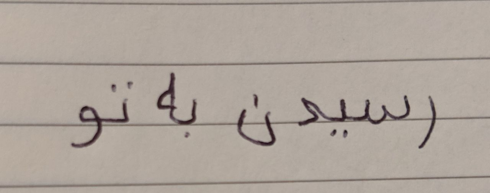

> Originally published on [Instagram](https://www.instagram.com/p/B0BeEF8Ir8n/)

## Reach you

All I need is to reach you.  
It's so easy.  
I can see you through the thick veil of pain and suffering.  

All I need is to reach you.  
All I have to do is reach out through the flames.  
My arm is burning, but who cares?  
For a second, I almost touched you.  

All I need is to reach you.  
This is one of my easier exercises.  
Every time I come near you, you lash out.  
Every time you shout, my world shatters into a million pieces.  
But when I cry, they are melting back into one piece again.  
All that's left are scars, pain, and a heart that grows up to be numb.  

All I need is to reach you.  
And I've become the best at this game.  
Swallow my pride, swallow my tears.  
Shut down my heart, that's how I win.  
It's so easy, it became a second nature to me.  

It could have all been so easy.  
But life is not easy.  
I did not take the chance to tell you how much I love you.  
And you never told me, and now you're gone.  

All I need is for you to reach out.  
Hold me, touch me, love me.  
Tell me it's going to be okay.  
I don't care if you hurt me, because I know you are hurt.  

All I need is for you to reach out.  
But below this pile of crap, I know there is a connection.  
It is stronger than any dimension like space and time.  
We had our moments of unspoken magic, love and divinity.  
And in times of darkness, I hold on to them.  

So in a way, we have reached each other long before.  
Long before I could walk, or talk.  
Along the way, I have forgotten myself.  
Now, I am replaying our little game with myself.  
It gets really tiring, and it's not even half as fun.  

All I need is for you to reach out.  
I still need you.  
People say I'm grown up now, but I feel like a baby.  
My scars hurt, I am clueless, and I could use a little help.  

All I ask is a little guidance, reassurance, and love.  
I promise I will not waste it, because it's precious to me.  

All I need is for you to love me, support me, and guide me.  
Is that too much to ask?