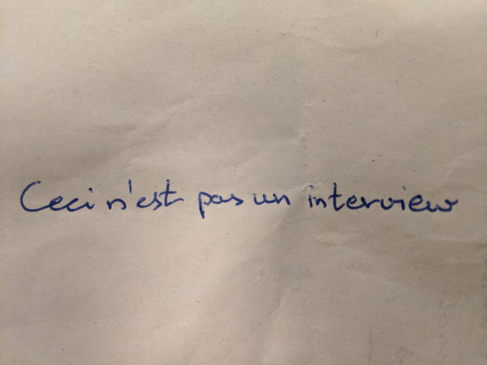

> This is not an interview with a poet.

**Reporter:**

What is the meaning of poetry to you?

**Poet:**

You know - poets open doors to worlds.

As I ease myself into the seat before the stage,  
I am resting in the promise of complete acceptance and vulnerability  
just like my head rests in the lap of mother earth.  

My heart recognizes the presence of the poet on stage,  
as they start forming a cushy pillow of clouds -  
ready to carry me to the highest mountains and the lowest oceans.  

The poet is pouring out their heart into a cup of words,  
just like the wisdom is flowing into my thirsty ears.  
My tears can't help but start to weep -  
everything is when truth caresses my heart.  

Do I dismiss their world?  
Do I get lost, devoured even?  

Or do the clouds indeed carry me away,  
through the skies and into the abyss,  
always ready to bring me right back to myself?  

Poets open doors to worlds.  

Therefore: when you speak and when you listen -  
sense when they are opening,  
and when they open you.  

And as you know the stage is life,  
and everyone is a poet.  

In this magic, I find space and permission to be.  
That - that is the unbelievably beautiful meaning of poetry to me.  