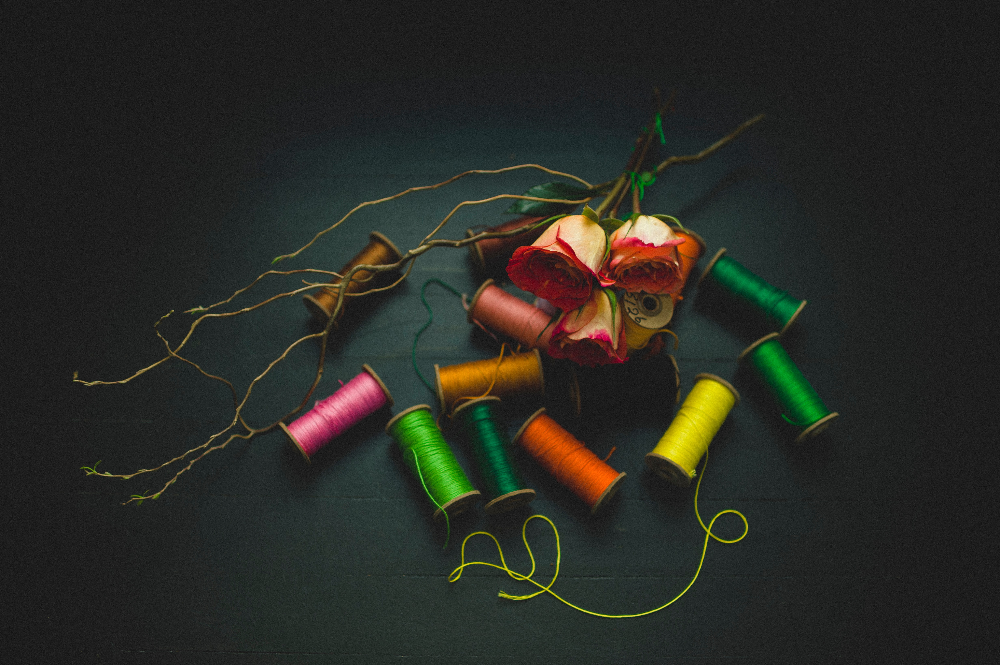

> [Photo](https://unsplash.com/photos/aGz5hkren64) by frank mckenna on Unsplash

I really enjoy the new label I put on articles like this one. I call them "Gedankenfetzen", a German word that could be translated to "shreds of thoughts" or "not necessarily connected pieces of thoughts". A [Gedankenfetzen](/categories/gedankenfetzen) on this blog is a quick thought that does not aspire to be super insightful or having a certain point in mind. It's just a thought that's on my mind at this particular time.

The label Gedankenfetzen is very liberating, as it allows me to simply express this thought in its current form; I have no expectation or "quality standard" to fulfill - something I _do_ have internally for other articles I publish here.

Putting a Gedankenfetzen "on paper" (on my blog) is extremely satisfying and helpful; and sometimes this act of expression is the first small step towards revealing something bigger inside me. I think of writing Gedankenfetzen like trying to pull a thread of unknown length from my brain.

Sometimes, the thread turns out to be quite short - then, pulling it out was an important step of making space for other thoughts to grow or to be revealed. At other times, the thread turns out to be a convenient entry point into a complex web of insights, thoughts, feelings and ideas. In this case, again, pulling at the thread was an important step in getting a little closer to understanding the complex idea behind it.

---

In any case - don't read too much into Gedankenfetzen I share here. However, I do invite you, if you like, to connect with my thoughts! See what thoughts or feelings they invoke in yourself. And, if you like, share _that_ with me - or the world. I would be delighted!

What wondrous feeling it is to see this dynamic unfold - how one thread morphes into another, changing its color and shape at every step. How a threads turns into words and then into action. And finally, it is manifested in the physical world. This is how anything is created. The first step of creation is to think.

