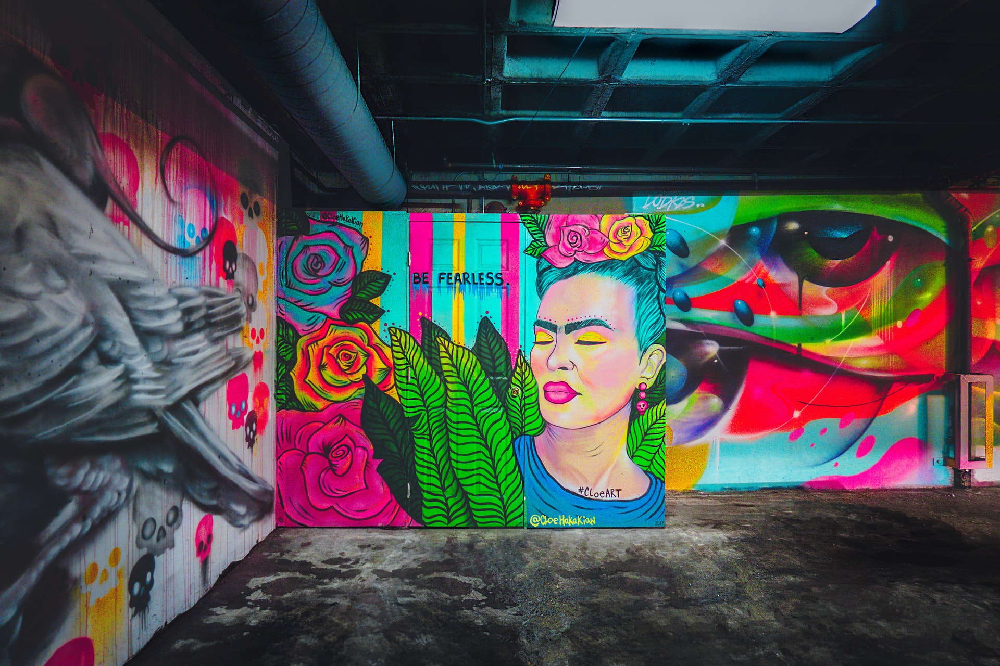

> From a closed to an open mindset. Be Fearless!

> [Photo](https://unsplash.com/photos/JfHRmaUP0z8) by JOSHUA COLEMAN on Unsplash

## Below my potential

I used to believe that I am living below my potential for as long as I can think.

I was doing great in school and in sports, and I was having an easy time connecting with people as well. Continuously, I received signals from my surrounding that I was being special and a high achiever. At the same time, I never felt being seen or acknowledged for who I truly was without those achievements. Also, things that came effortless to me sometimes were seen as big achievements, which was confusing and frustrating at the same time.

To compensate, I felt the need to push for more, achieve better and bigger things and never appreciated what I already had.

I kept this mindset far into my adulthood. Until recently, I found myself striving for "success", striving for bigger, better, faster, stronger. I used to think "I could do so much better, I suck".

What's so interesting about this thought is that I did not think in concrete terms. I did not set out measured goals like "I want to double my client base" or "I want to be able to speak one more language". My thought was very vague - "I could do so much more"!

## Potential is infinite

Today, I realize that comparing myself to some vague potential does not serve me.

The truth is, there are countless things I can do at any point in time. There are countless aspects of myself and my life that I can improve on. However, I can only pick one of them at a given time. There likely is no point at which I will be able to say "I reached my potential. Now, I'm done". There is potential for endless expansion and growth.

I limited myself by the belief that I am living below my potential. This stems from a closed mindset that puts me in a victim position, always creating dissatisfaction by focusing on what I do not have, what I did not achieve.

## An open mindset towards growth

Instead, I switched my focus on how amazing it is that there are endless possibilities - and I want to explore them! I follow an approach that represents an open mindset instead.

1. Self-assessment
2. Developing my taste
3. Taking action

### Assessing myself honestly

A crucial first step in growth is to localize myself, get to know myself. Where do I stand today?

This can be done across all aspects of myself and life - professionally, personally, spiritually, etc. This step is fairly objective - it's like a collection of all the data points about me.

Apart from localizing where I am today, I can also think about the direction I'm headed to (1st derivative) or even whether there is any change of my direction (2nd derivative).

### Developing my taste authentically

Based on the initial self-assessment, I can start identifying aspects that are not in my favor.

Say, I am not happy with my professional situation. Or, there is an aspect of my personality that I am not happy with. This part is highly subjective and up to my own taste and judgement. Essentially, this step is a decision about who the person is I want to become, and is fueled by my authentic self.

Again, I can take into account the 1st and 2nd derivative. If I am not happy with my professional situation, but I am already taking steps into a "positive" direction - check! However, if instead there is no foreseeable change coming up - I identified a possible aspect for growth!

### Taking action self-responsibly

The initial two steps rewarded me with an assessment of my current state and an idea of where I want to move towards.
I enter the final step by living self-responsibly and honestly to myself: I take action to change myself or my circumstances towards the version I prefer. This step is all about creation!

By following my intuition and sending impulses out into the world, I make an impact and see things unfold. I express myself authentically and detach myself from any one outcome. I lean back, putting my trust into myself and the universe that what I create will be beautiful in its own right.

## My journey through life

With the above framework in mind, I regard my journey through life as going through multiple iterations of these steps.
Over time, I will fine-tune my senses and increase my self-awareness, as well as developing a more accurate and nuanced taste for the person I want to become. Finally, I embrace my self-responsiblity to create impactful actions fearlessly.

Taking on an open mindset towards myself and the world allows me to experience life with gratitude, joy and authenticity. I am excited for what is yet to come! 🌠