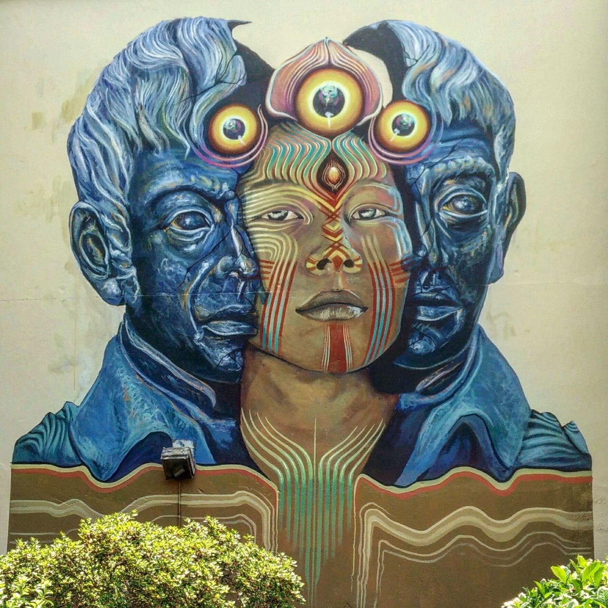

One of the most fulfilling experiences I know is when someone approaches me in real life and tells me something I created has touched them deeply.

> Wall mural in Caldas de Reyes, July 2018.

I believe that this kind of deep connection - if only for a brief moment - is only possible on the foundation of vulnerability and authenticity.

It is not the outcome I expect or want to enforce when creating. But it is an outcome made possible by my approach. I get joy out of the act of authentic self-expression. Anything beyond that is an added bonus that I can't and won't measure.

The world of human connection is (still) beyond our scientific understanding.
One second of a deeply connected moment between two strange souls can be more profound and impactful than everything you have experienced in your life up to that moment combined.

These are the moments that my heart desires, and I am grateful to have experienced them before and humbled to have the chance to experience this joy.

Dear reader, I encourage you to embrace and show yourself in full authenticity. Take courage to express yourself from the bottom of your heart, and experience the impact that has on yourself and the world.

This is the world I aspire to live in, this is the world I prioritize.