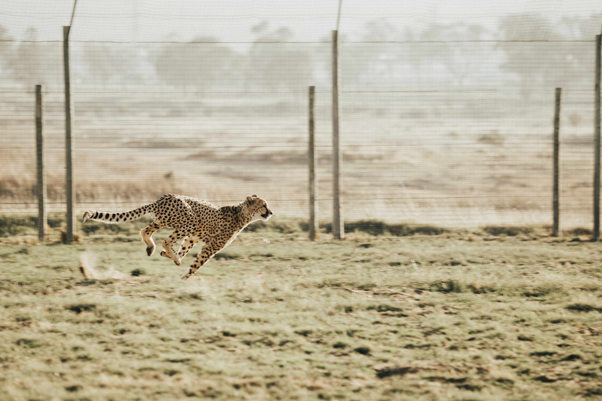

> [Photo](https://unsplash.com/photos/34OTzkN-nuc) by Cara Fuller on Unsplash

Recently, I keep finding myself saying that "yeah, recently I am going through a lot of change".
I've kept finding myself recently saying that phrase for the past... five years or so now.
So, what is a constant feeling of recency has grown to become an old habit already. Time flies.

I find myself on [my longest chase](https://www.instagram.com/p/CM9yl3kH5WG/).

## Does Big Beget Bigger?

I've built a life that allows me to focus on transformation. And transformation is accelerating [like an avalanche](/posts/my-journey-2018/).

I've experienced a new kind of change since [reconnecting with my family last October](/posts/collect-small-pieces-consistently/). That's almost a year ago now. And I've written much less this year compared to the previous ones.

With all the change, challenges, growth I am experiencing, and all the progress I make, I caught myself silently wondering, lying in wait.

> Where is the next big change? Why is nothing happening?

With all the wild things happening around me and in me, there is a growing impatience. And I realized, there is an uncalled for demand in me, that keeps me from acknowledging what _is_. I identified a strong desire for transformation in myself, and I write these lines to get clarity.

**The question is, does going through big changes entitle me to go through even bigger changes aftewards? Does going through big change once entitle me to go through big change again?**

## Chasing Big Dreams

I haven't yet found a good way to go about my ambitions. **I am chasing big dreams.**

I do like to work on exciting projects, grow in the process, and make more impactful contributions over time.
I have some goals and directions I am developing towards, but overall it is quite the open field still.

Actually I like this, as in the uncertainty lies a lot of fun, and lots of things lie in front of me that I couldn't even dream of yet. As [Sadhguru says](https://www.instagram.com/p/CQzyVHggU60/) - 

> May your dreams not come true. May things that you could never dream of happen to you.

## From Chasing Dreams - to Being Haunted by Nightmares

However, I noticed a pattern - I am switching back an forth between two modes.

In the first mode, I am **focused**. I am following my dreams, making progress every day. I accomplish Big Things™️. I'm in my flow.

But over time, I lose myself in the process, and slowly I descent into a **downwards spiral** - the second mode. Instead of focusing on myself and my path, my attention goes more and more towards this hollow craving of wanting the next big hit, the next big accomplishment. I start to dislike the process, and grow unsatisfied.

**Basically, I am jumping from chasing my dreams - which can be a very joyful and healthy experience - to being haunted by them. From dreams to nightmares.**

The downwards spiral has two effects:

1. I stop enjoying the process of life itself.
2. I stop making real progress. Instead, I go in circles.

## My Way of Dealing with the Downward Spiral

A big part of dealing with the downward spiral is to __prevent it__ from starting in the first place. [Fundamentals](/posts/choose-your-fundamentals) are a great way to lift the baseline.

Another way that has proved very useful to me when I notice that I'm about to fall into a downwards spiral is to fall back to doing things I really enjoy. This could be eating my favorite food, going on a walk, [playing the Setar](https://www.youtube.com/playlist?list=PLkjDU6MTx8yxfjvCMAKlD5KaGQQ2MFtmP), scribbling in my notebook, listening to music, reading a book I enjoy, or dancing.

## The Essence

The essence of this article is that chasing big achievements has made me lose sight of the beauty that is in every moment - the magic that it carries within. It can be very small, but can deliver an immense power and can feel very big.

I've been trying to hunt for something bigger, which made me forget that I am living the biggest joy every day - my life itself.
I will focus my attention on seeing anything that happens with the same intensity and "size", because every moment and everything is small and big and wonderful.

> In your pursuit for happiness, do not forget your joy.
>
> In your chase for something big, do not lose sight of what matters right now, right here.
>
> In your search for love, make sure to come from love, not fear.