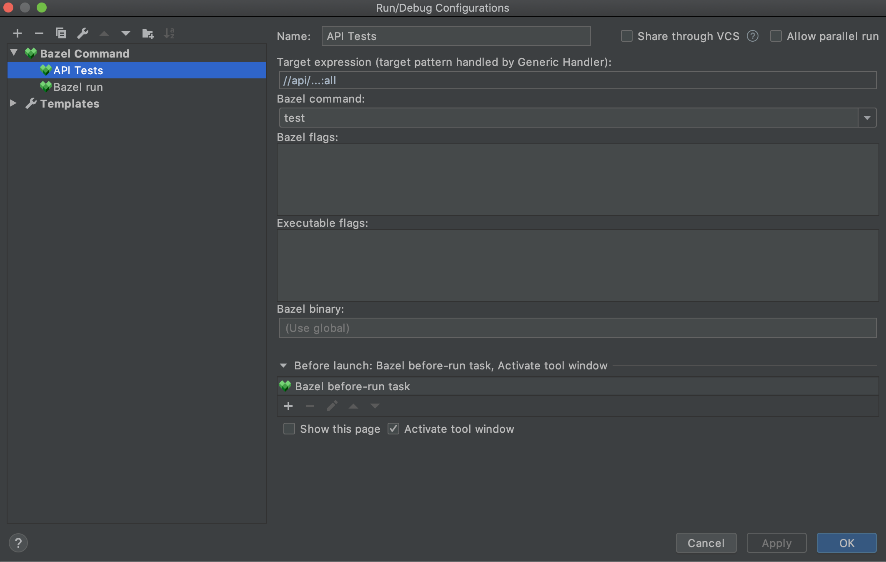

[Bazel](https://bazel.build/) is a build tool that is commonly used for Java, C++, Android, iOS, Go and more languages.

`bazel test` allows you to run the tests in your project.

## Running All Tests in a Specific Package

Like `bazel build`, `bazel test` accepts a __target specification__ to specify which tests to run. Here's a detailed overview of the [bazel target specification syntax](https://docs.bazel.build/versions/4.1.0/guide.html#specifying-targets-to-build).

Here, I'm showing how to select tests from a specific package and folder. Suppose that your project structure is as follows:

```sh
.
├── api
│   ├── BUILD
│   └── src
│       ├── main
│       └── test
└── core
    └── utils
        ├── BUILD
        └── src
            ├── main
            └── test
```

Note that the `BUILD` files are Bazel specific build configuration files. Here are the commands you need to run:

```sh
# run all tests; in this case, tests below `api` an `core` folders
bazel test //...

# run all tests in `api` package; both commands are equivalent
//api/...:all
//api/...

# run all tests in `core/utils` package
//core/utils:all
```

## Running Tests with Bazel in IntelliJ IDEA

In IntelliJ IDEA, if you installed the [Bazel plugin](https://plugins.jetbrains.com/plugin/8609-bazel), you can create a new **Run Configuration** to run all tests in a specific folder.

Here is an example for the folder `api`:

