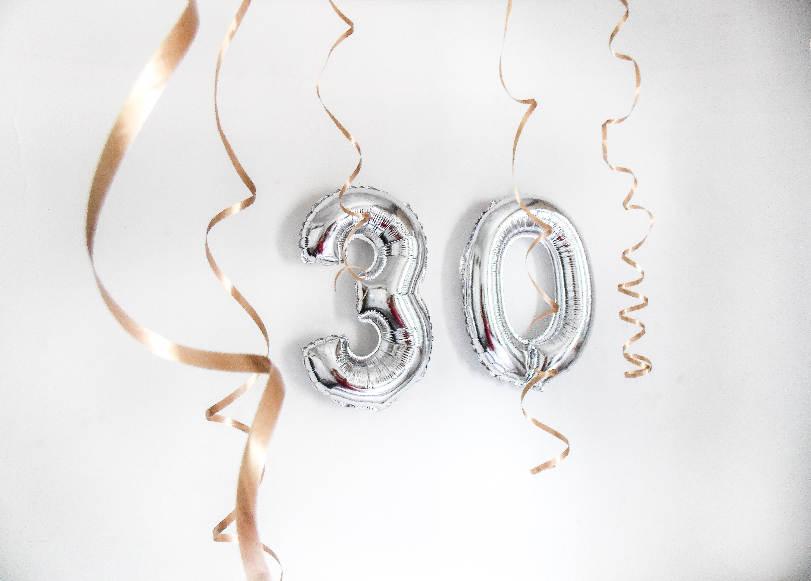

> [Photo](https://unsplash.com/photos/ahuHrVjcWN0) by Marina Lima on Unsplash

## Turning 30

Today is 30th birthdays. That makes 30 full rotations around the sun - quite the distance! Here are some of my reflections so far.

## Fundamentals and Basic

It's all about sticking to the fundamentals. Taking full ownership over my life. Reminding myself again and again that acceptance, gratitude, authenticity, self-responsibility, equanimity is the way.

I'm still building my foundation. There are many days where I feel down.
I finally know why I've felt shitty for large parts of my life. I've done the work. I've threw myself into this life. More and more, I can focus on **here and now**, and look towards the futuree, rather than being busy with past emotions and thoughts.

The thing with life is that once you start living, it keeps growing more intense. It's not your job to make sure it does, it happens all by itself.
My focus needs to be on becoming the best and most joyful I can, so I can handle yourself, and whatever comes at me.

I know I have a long way in front of me. But I've been coming all this way to continue, and grow into my best version.
Now more than ever.

## Growing Up - Grown up?

I am proud about making it this far. I am proud of having released my poem collection [GROWING UP](/growing-up).
It was important to me to publish it before I grew 30. It marks a personal milestone to me, and celebrates the pains and joys of growing up.

Ironically, I don't feel grown up at all. But I think that's part of the journey of growing up.
At some point you embrace the growth, the challenges, the set backs. But also the joy of exploring, experiencing - _living_ - life.

Hopefully, there will be no point where I will say - _"Yep, now I've finally grown up! No more growing from here on out"_.

## Regrets and vows

I regret denying myself and shutting down my inner voice so many times.
I regret not staying in connection so often, especially in the hard moments.

Regrets are fine, but they don't need to be hold in contempt.
I've forgiven myself and people who I came across in life. It's a large burden gone away.

I vow to always stay in connection, first and foremost with myself - also, with everyone and everything else.
That doesn't mean I have to like everyone, or be "nice".

It does mean being present in the moment, with my entire self, including my anger, sadness, joy, doubt, and so on;
staying in connection with the other, through eye contact, communication, setting of boundaries.

I choose love in every single moment of my life.

## Seeking truth

In poetry I've found my voice, and in playing Setar I've found my tune.
I am grateful for everyone in my life. Everyone I met gave me the opportunity to learn more about my truth and the truth of the world.

I am seeking for truth in everything, and there's still lots to explore.
## Looking forward

I think what awaits me is more of everything - the Good, the Bad, and the Ugly.

I expect more fun projects, more self-expression, more poetry, Setar, creativity and joy; more amazing friends and relationships, more growth and fun!

I experience life in repeated ups and down - feeling full of joy, feeling less in joy, feeling apathethic, feeling absolutely miserable, feeling slightly less miserable - repeat. I think a major breakthrough that's around the corner is to break that pattern. 

I am looking forward to many more decades ahead. Finally I feel like I'm on the right path.

