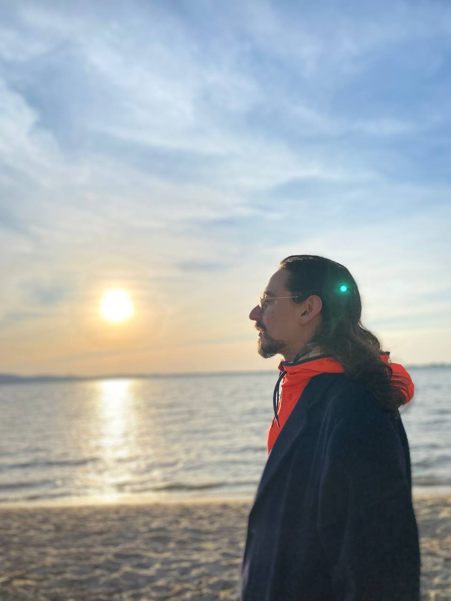

I smile, and take a step ahead into the world. I know the world won't break me, it can't. Instead, I'm further on my hike, the path I laid out for myself in front. The wind talks to me when I listen. He says

> Do wander off all the paths, don't miss your chance. Keep on following your nose, your instincts, meet all the trouble you can find.

I take another step and see the world and all it hosts. I speak to everything, from trees to ants, from birds to ghosts. I know the wind is in my back, and anytime I need his help he's listening. He says

> Make sure to keep your friends all by your side. And if one is in danger or alone, don't hesitate. Reach out your hand and show them all your love, help them along. Show them your heart and you will see, they open theirs and you can meet.

As I continue on my road, I start to skip and jump and glow. A goat is greeting me with upright poise. She shares her wisdom with me and guides me on my path to come, and we both know that we belong. We exchange more than words, we see each other truly. We have a heartful good bye and I'm on my way, following the path in front.

I come across a giant lake, so big that I can't see its end. The wind, he says

> Feel all your pain, and listen to your heart. Embrace your feelings, they won't let you go. They are your strength, they are your beauty. Let them guide you through the darkness and sweeten the brightness of the light.

I start to laugh and run, and without fear I dive unto the bottom of the lake. I hold my breath, and I see darkness and I feel cold, but I know that I am safe. I meet a fish and we exchange a look of knowing and of bliss. He lets me ride his back and carries me through the water, he reminds me that I can breath and swim myself. And so we breath and swim together, and we feel free. He looks at me with love and confidence as I reach the shore and say good bye.

I lay down below a tree to rest. And as I fall asleep, I hear a whisper, it says

> I've guided you for long enough. Now I must leave, for I have other places to be. I know that you are ready. Whenever you need me, just listen to the trees, the leaves, the whispers in the air - they bear my message. Now go and find your luck.

I fall asleep, and in my dreams I'm floating high above the sky. And while I sleep, the sun is looking at me, she keeps on smiling, warming. And as I fly and as I am free, I feel her warmth and feel her smile. She dries the water off of me, she smiles and let's me know she's always there for me, no words are necessary.

As I wake up, I know I need to continue on the path in front of me, the path I laid out for myself. I know I'm not alone, I have all the support I need in the world. And as I move towards the forest, I hear the whispers, they say

> Don't forget, we'll always be here right at your side. We love you and we make you see. Don't despair and don't regret, now it's up to you to have your own back. We are the wind, we are the sun, we are the fish, we are the goat. Always remember who you are, you are the rain. Remember, you are Nilan.

My heart is warmed, my sight is true. I take a step smiling and with tears in my eyes as I continue my hike.