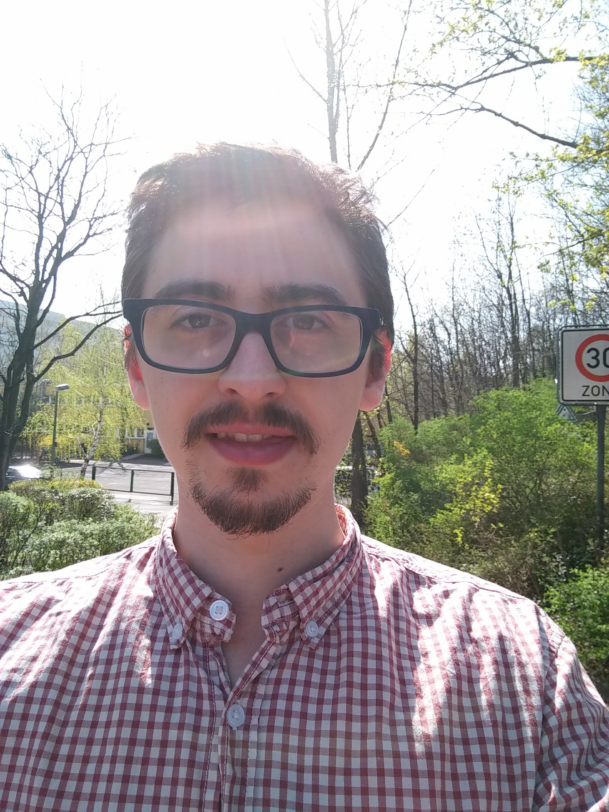

I am a poet at heart, a seeker of truth. I care deeply about self-expression and authenticity.

I support individuals as a [life coach](/coaching) and companies as a [consultant](/consulting) in the intersection of tech, community, product, content, customers.

My latest project [GROWING UP](/growing-up) gives room for self-reflection, processing trauma and embracing life as it is. This collection of 30+ poems about the ups and down of GROWING UP comes in three parts: My Past, My Self, My Horizons.

What really fascinates me is learning more about people and human culture. I love meeting people, listening to [their stories](/posts/tonight/), and growing in the process. I also like to tell [my own stories](/categories/personal).

I'm always open for a conversation, to explore everything from the most essential to the most mundane aspects of life. You can reach me [via email](mailto:nilan.marktanner@gmail.com) or [Twitter](https://twitter.com/_marktani) for a chat.
