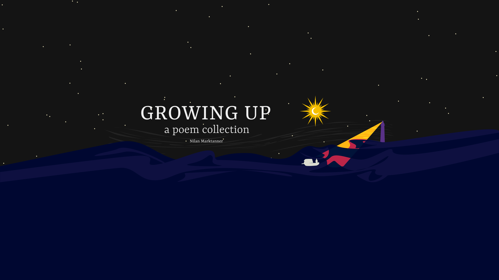

<iframe width="560" height="315" src="https://www.youtube.com/embed/OPRS-xVpU4w" title="YouTube video player" frameborder="0" allow="accelerometer; autoplay; clipboard-write; encrypted-media; gyroscope; picture-in-picture" allowfullscreen></iframe>

All we do is **GROWING UP**. Life is a cycle of struggle and growth that keeps repeating. There is only one direction: forward.

Reflecting upon oneself, processing trauma and embracing life as it is, this collection of 30+ poems about the ups and down of **GROWING UP** comes in three parts: My Past, My Self, My Horizons.

Each poem is accompanied by exclusive commentary from the author relating it to the experience of **GROWING UP**.

**GROWING UP** is available as ebook on [Gumroad](https://gumroad.com/l/growing-up) and as paperback on [Amazon US](https://www.amazon.com/dp/B095GLS2X6) | [Amazon UK](https://www.amazon.co.uk/dp/B095GLS2X6) | [Amazon DE](https://www.amazon.de/dp/B095GLS2X6) | [Amazon FR](https://www.amazon.fr/dp/B095GLS2X6) | [Amazon ES](https://www.amazon.es/dp/B095GLS2X6) | [Amazon IT](https://www.amazon.it/dp/B095GLS2X6) | [Amazon JP](https://www.amazon.co.jp/dp/B095GLS2X6) | [Amazon CA](https://www.amazon.ca/dp/B095GLS2X6) | [Amazon AU](https://www.amazon.com.au/dp/B095GLS2X6).
